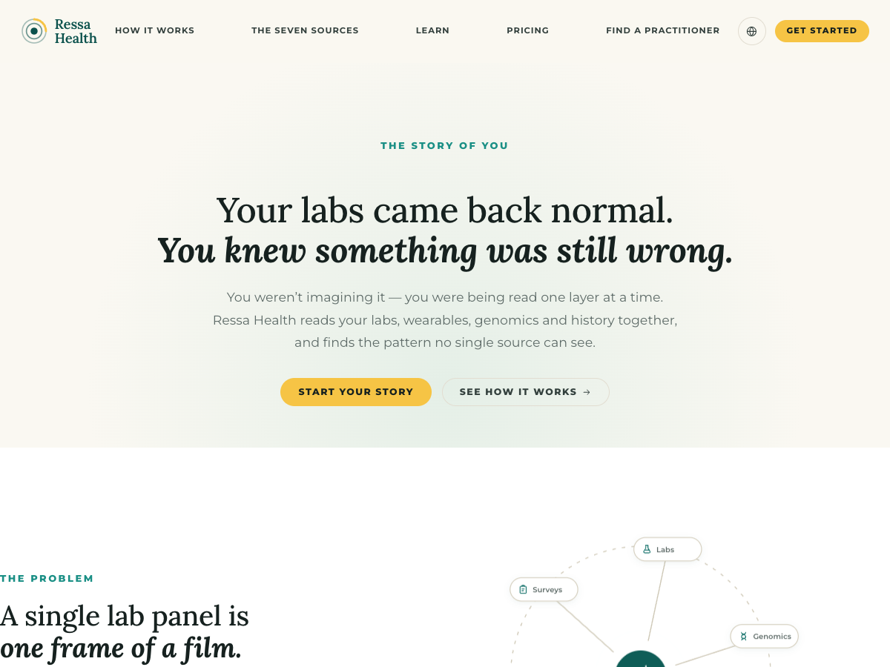

# Ressa Health — WordPress Theme

A custom, fully responsive WordPress theme built to the Ressa Health landing page design.
Every section of the front page is editable in WordPress; nothing is hard-coded into the templates.



---

## Requirements

| | |
|---|---|
| WordPress | 6.0+ |
| PHP | 7.4+ |
| Node (build only) | 18+ |

No plugins are required. The theme has no third-party runtime dependencies — no jQuery on the
front end, no carousel library, no animation library, no CDN assets other than Google Fonts.

## Install

1. Copy this folder into `wp-content/themes/ressa-health` (or upload the zip via **Appearance → Themes → Add New**).
2. Activate **Ressa Health**.
3. Create a page and set it as the static front page under **Settings → Reading**, or leave the
   front page as the blog — `front-page.php` renders the landing page either way.

On activation the theme already renders the full design using the bundled starter content, so
there is no empty-state to configure before it looks right.

---

## Editing the content

### Headlines, intro copy and buttons — Appearance → Customize

Everything lives under the **Ressa Health Content** panel, one section per band of the page:

* Brand & Header, Hero, The Problem, Statement, Seven Layers, How It Works, The Output,
  Platform Features, Comparison, Member Stories, Medical Team, Trust, FAQ, Closing CTA, Footer.
* **Section Visibility** switches any band of the front page on or off.

Headline fields accept a small set of inline tags so the two-tone lockups from the design can be
authored directly:

```html
Everyone else reads one layer.<br><em>We read seven.</em>
```

`<em>` renders as the bold italic serif, `<strong>` as bold, and `<br>` forces the line break.
Anything else is stripped on save.

### Repeating content — the “Front Page” admin menu

Each repeating group is a custom post type with its own fields. Drag the **Order** value
(Page Attributes → Order) to control sequence.

| Group | Drives | Notes |
|---|---|---|
| Data Layers | The “We read seven” tabs and wheel | Order = order around the wheel. Featured image fills the wheel slice; the accent colour is used until one is set. |
| Process Steps | Test → Analyze → Act | The short *rail label* is the pill text; the *step label* is the “Step 01” line. |
| Platform Features | The six-card grid | Featured image is the card visual. |
| Member Stories | The story carousel | Choose **Video** or **Pull quote** per slide. Video slides play muted on hover. |
| Team Members | The medical team row | Featured image is the portrait. |
| Comparison Rows | The comparison table | Two dropdowns per row: included / not included. |
| Trust Promises | The four mint cards | |
| FAQs | The accordion | |

Menus: **Appearance → Menus** provides *Primary*, three footer columns and a legal row. Until a
menu is assigned, the header falls back to the navigation shown in the design.

Logo: **Appearance → Customize → Site Identity** replaces the placeholder brand mark.

---

## The three signature interactions

**Seven-layer tabs.** Selecting a tab cross-fades the copy panel and blooms the matching slice of
the wheel open from the centre, while the spoke marker and label update in step. Full keyboard
support (arrow keys, Home/End) and correct `role="tablist"` semantics. Clicking a label on the
wheel itself also selects that layer.

**Test → Analyze → Act.** The “Works with the data you already have” band pins to the viewport and
advances one step at a time as the page scrolls, forwards and backwards. The rail doubles as a
progress bar and as a jump control. Below 992px — and whenever reduced motion is requested — the
pin is dropped and the three steps simply stack.

**Story carousel.** A dependency-free slider with pointer dragging, keyboard arrows, dots and
disabled-state arrows. Video slides start muted and play on hover or keyboard focus, and pause on
leave; the play button toggles them on touch devices. Off-screen slides are removed from the tab
order.

## Motion

Reveals, staggered entrances, parallax and hover states are all built on one shared
`requestAnimationFrame` scroll loop and a single `IntersectionObserver`.

`prefers-reduced-motion: reduce` is respected globally: transforms are neutralised, animations are
collapsed, the pinned step sequence becomes a plain stack, and smooth scrolling is turned off.
With JavaScript disabled the page renders complete and readable — the `no-js` class guarantees
every revealed element starts visible.

---

## Working on the styles

Styles are authored in SCSS under `assets/scss` and compiled to `assets/css/main.css`, which is the
file WordPress enqueues. `style.css` carries only the theme header.

```bash
npm install
npm run dev:css     # watch
npm run build:css   # compressed production build
```

```
assets/scss
├── abstracts/   tokens and mixins
├── base/        reset, root custom properties, typography, animation primitives
├── layout/      container scale, header, footer
├── components/  buttons, pills, media frames, WordPress core markup
└── sections/    one partial per band of the front page
```

Design tokens live in `abstracts/_variables.scss` and are mirrored onto `:root` in
`base/_root.scss`, so the same palette is available to the block editor and to inline styles.

## Template map

```
front-page.php              renders the sections in order, honouring the visibility toggles
template-parts/sections/    one partial per band
template-parts/content/     story card, entry card, phone demo
inc/fields.php              the single schema that drives post types, meta boxes and the Customizer
inc/defaults.php            bundled starter content
inc/content.php             the accessors templates use
inc/svg.php                 icon set plus the generated wheel and orbit illustrations
inc/template-tags.php       section heads, buttons, pills, brand lockup
```

Adding an editable field anywhere means adding one array entry to `inc/fields.php`; the meta box,
the sanitiser and the Customizer control are all generated from it.

## Placeholders shipped with the theme

The design comp uses photography and final iconography that is not part of this handover, so the
theme ships neutral stand-ins that are meant to be replaced:

* Flat colour media frames for feature, step, story and team images — these match the comp, and
  become real images as soon as a featured image is set.
* A line-icon set in `inc/svg.php` (`ressa_icon_paths()`), used for the orbit diagram, feature
  frames and UI affordances.
* A generated brand mark in `ressa_brand_mark()`.
* `assets/media/story-placeholder.mp4`, an abstract 4-second clip used by story cards that have no
  video yet, so the hover-to-play behaviour is demonstrable out of the box.

## Accessibility

Landmark elements and a skip link, `aria-labelledby` on every section, real `tablist` /
`tabpanel` / `region` semantics, visible focus rings, `screen-reader-text` labels on every
icon-only control, and a comparison table built from `<th scope>` with a caption.

## Notes

* The design comp ends at the closing call to action. A compact footer (brand, three link columns,
  legal row) has been added because a WordPress theme needs one; it uses the same tokens and can be
  hidden by removing the menus.
* `.preview/` contains the local render harness used to check the build against the comp. It is not
  part of the theme and is excluded from version control.
